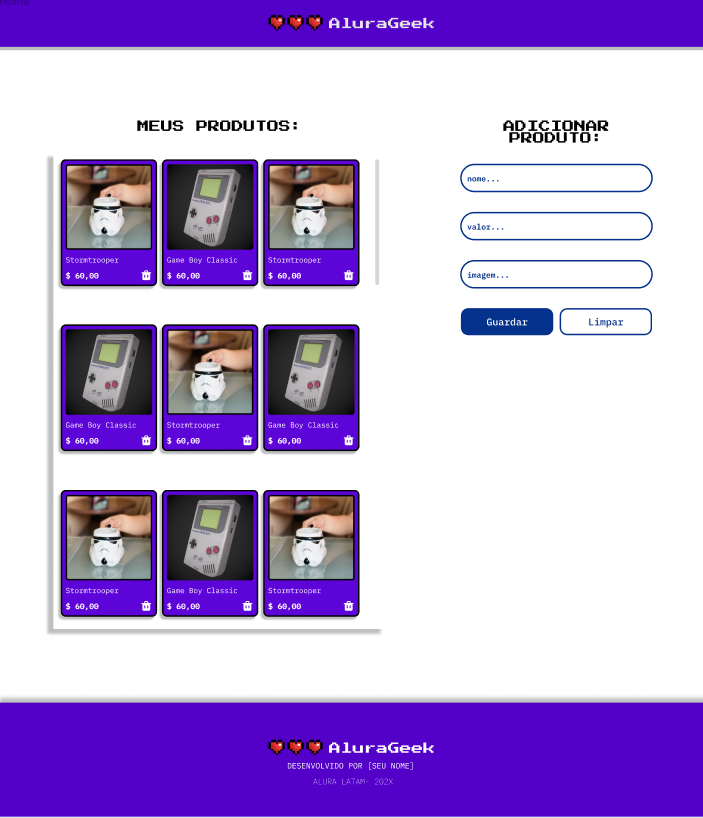
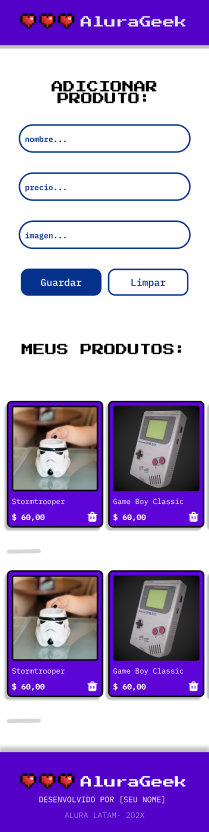

 
 

# Alura Geek - Desafio do E-commerce
  #### Projeto desenvolvido no programa ONE - Alura e Oracle
  Um desafio para praticar o CRUD,mais especificamente a parte de Create, Read e Delete (Criação, Leitura e Exclusão) e experimentar o que um programador front-end vivencia no seu dia a dia, criando interfaces funcionais e desenvolvendo um raciocínio lógico focado na resolução de problemas.

  Foram aplicados conceitos fundamentais como manipulação do DOM, de como a web funciona e o uso dos métodos GET, POST e DELETE, promessas, consumo de APIs e a realização de requisições ao servidor (json-server). Programação assíncrona, juntamente com outros conceitos avançados de JavaScript.
 
  ## 🛠️Funcionalidades do projeto
  - Projeto com design responsivo que permite que o usuário acesse de dispositivos diferentes. 
  - Adicionar e excluir produtos na tela.

  ## ⌨️Tecnologias utilizadas
   - HTML
   - CSS
   - JavaScript
   - json-server

   ## Designe responsivo
   

   ## 🔗Acesso ao projeto
   Acesse: (https://thiarafernandes.github.io/challengue-aluraGeek/)

